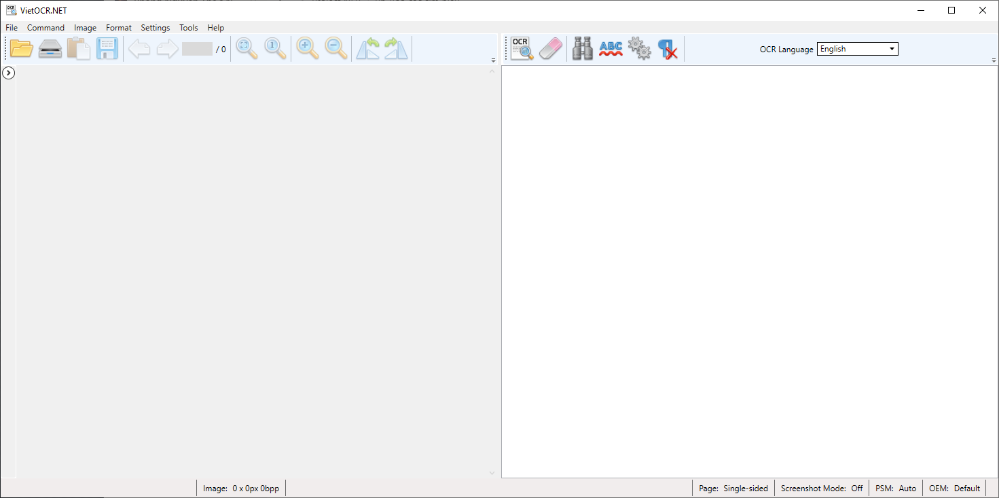

# ĐỒ ÁN MÔN HỌC - XỬ LÍ NGÔN NGỮ TỰ NHIÊN

# ***THÔNG TIN ĐỒ ÁN:***

- Tên đồ án: Xử lí ngôn ngữ tự nhiên (Natural Language Processing) - NLP
- Lớp: Trí tuệ nhân tạo - 21TNT1
- Trường: Đại học Khoa học tự nhiên - ĐHQG TPHCM (HCMUS)
- Môn: Giới thiệu trí tuệ nhân tạo - CSC00006
- Họ và tên người tham gia đồ án:
    - Trần Ngọc Bảo (Nhóm trưởng)
    - Nguyễn Anh Khôi
    - Nguyễn Chí Cường
    - Nguyễn Văn Trí
    - Nguyễn Thế Phong

# *NỘI DUNG ĐỒ ÁN - MỤC TIÊU CỦA PHẦN MỀM*

- Là ứng dụng tìm kiếm cơ bản
- Cách thức hoạt động: OCR → NLP → Search

# *CÁCH THỨC TRIỂN KHAI - MÃ NGUỒN PHẦN MỀM*

## 1. OCR

1. Thông tin
    - App: VietOCR.
    - Độ chính xác rất cao: 90% → 95%
    - Các chức năng: OCR hình ảnh sang file txt, có chức năng chuyển nhiều file cùng 1 lúc.
    - Hỗ trợ đồng thời tiếng Anh và tiếng Việt
2. Cách cài đặt
    - Link download phần mềm: [https://sourceforge.net/projects/vietocr/](https://sourceforge.net/projects/vietocr/)
    - Tải về và cài đặt như bình thường
3. Sử dụng
    - Màn hình khởi động
        
        
        
    - Nếu OCR 1 file, kéo thả file vào vùng làm việc của ứng dụng và chọn Image→OCR all page
        
        
        
        Result
        
    - OCR nhiều file, chọn Image→Bulk OCR, sau đó điền folder input và output rồi enter
        
        
        
        
        
        Kết quả sau khi thử nghiệm OCR nhiều file
        
    
    ## 2. Xử lí ngôn ngữ tự nhiên (NLP)
    
    ## I. Tiếng Anh
    
    1. Thông tin
        - App: NLTK (Python)
        - Chức năng: Phân tích từ loại, loại bỏ stopword.
        - Ngôn ngữ hỗ trợ: Tiếng Anh
    2. Cài đặt
        
        ```python
        python -m pip install nltk
        nltk.download()
        ```
        
    3. Source code
        - Testing with model text
            - test.py
            
            ```python
            from nltk.corpus import stopwords
            from nltk.tokenize import word_tokenize
             
            example_sent = """This is a sample sentence,
                              showing off the stop words filtration."""
             
            stop_words = set(stopwords.words('english'))
             
            word_tokens = word_tokenize(example_sent)
             
            filtered_sentence = [w for w in word_tokens if not w.lower() in stop_words]
             
            filtered_sentence = []
             
            for w in word_tokens:
                if w not in stop_words:
                    filtered_sentence.append(w)
             
            print(word_tokens)
            print(filtered_sentence)
            ```
            
            → Output: 
            
            ```python
            ['This', 'is', 'a', 'sample', 'sentence', ',', 'showing', 
            'off', 'the', 'stop', 'words', 'filtration', '.']
            ['This', 'sample', 'sentence', ',', 'showing', 'stop',
            'words', 'filtration', '.']
            ```
            
        - Testing with file txt
            - Source code:
            
            ```python
            import io
            import sys
            from nltk.corpus import stopwords
            from nltk.tokenize import word_tokenize
             
            dir = sys.argv[1]
            
            # word_tokenize accepts
            # a string as an input, not a file.
            stop_words = set(stopwords.words('english'))
            file1 = open(dir)
             
            # Use this to read file content as a stream:
            line = file1.read()
            words = line.split()
            for r in words:
                if not r in stop_words:
                    appendFile = open('filteredtext.txt','a')
                    appendFile.write(" "+r)
                    appendFile.close()
            ```
            
            - Input: python [nlp.py](http://nlp.py) test.txt
            - Output: filteredtext.txt
    
    ## II. Tiếng Việt
    
    1. Thông tin
        - App: UndertheseaNLP (Python)
        - Chức năng: Phân tích từ loại, loại bỏ stopword.
        - Ngôn ngữ hỗ trợ: Tiếng Việt
    2. Source Code
        
        ```python
        import io
        import sys
        import os
        import subprocess
        from nltk.corpus import stopwords
        from nltk.tokenize import word_tokenize
        from difflib import SequenceMatcher
        import codecs
        import array as arr
        
        from nltk.corpus import stopwords
        from underthesea import word_tokenize #Use 'underthesea lib' instead of 'nltk' for better result
         
        
        dir = sys.argv[1]
        with io.open(dir,'r',encoding='utf8') as file:
            text = file.read().replace('\n', '')
        text = word_tokenize(text)
        
        stop_words = set(stopwords.words('vietnamese'))
          
        filtered_sentence = [w for w in text if not w.lower() in stop_words]
         
        filtered_sentence = []
         
        for w in text:
            if w not in stop_words:
                filtered_sentence.append(w)
         
        
        print(filtered_sentence)
        
        for r in filtered_sentence:
            with io.open('filteredtext.txt','a',encoding='utf8') as file:
                file.write(r + " ")
                file.close()
        ```
        Nếu có lỗi xảy ra, vui lòng vào đường link này để tham khảo giải pháp: https://spot-carp-c44.notion.site/Error-No-such-file-419abbee0f914e3cb9e92ac2852856b0

## 3. Tìm kiếm trong 2000 tệp văn bản (Đã OCR sang file .txt)

## I. Tiếng Anh & Tiếng Việt

1. Source code
    
    ```python
    import io
    import sys
    import os
    import subprocess
    from nltk.corpus import stopwords
    from nltk.tokenize import word_tokenize
    from difflib import SequenceMatcher
    import codecs
    import array as arr
    
    types_of_encoding = ["utf8", "cp1252"]
    def similar(a,b):
        return SequenceMatcher(None, a, b).ratio()
    dir = sys.argv[1]
    dir2 = sys.argv[2]
    
    with io.open(dir,'r',encoding='utf8') as file:
        data = file.read().replace('\n', '')
    
    # get file ketqua.txt
    # os.chdir(dir2)
    os.system('dir /b /a-d '+ dir2+ " > 5e95d803.tmp")
    #dir folder 
    fo = open("5e95d803.tmp", "r")
    tmps = []
    with open ("5e95d803.tmp") as textFile:
        for line in textFile:
            tmp = line.strip()
            tmps.append(tmp)
    #get list of file to tmps array
    fo.close()
    os.remove("5e95d803.tmp")
    os.chdir(dir2)
    ratiocalc = 0
    ratioMAX = 0
    i = 0
    ratioarray = []
    name = []
    for x in tmps:
        with io.open(x,'r',encoding='utf8') as file199111:
            dataclone = file199111.read().replace('\n', '')
            tmp1234 = similar (data, dataclone) 
            ratioarray.append(tmp1234)
            name.append(x)
    
    #so sánh
    for j in range(len(ratioarray)):
        #initially swapped is false
        swapped = False
        i = 0
        while i<len(ratioarray)-1:
            #comparing the adjacent elements
            if ratioarray[i]<ratioarray[i+1]:
                #swapping
                name[i],name[i+1] = name[i+1],name[i]
                ratioarray[i],ratioarray[i+1] = ratioarray[i+1],ratioarray[i]
                
                #Changing the value of swapped
                swapped = True
            i = i+1
        #if swapped is false then the list is sorted
        #we can stop the loop
        if swapped == False:
            break
    
    unique_l = sorted(set(name), key=name.index)
    
    print ("Files that are most similar to the given content")
    for i in range(len(unique_l)):
        print (unique_l[i])
        if i == 4:
            break
    ```
    
2. Example
    
    INPUT: 
    
    ```bash
    python NLP_Search_Files_ENG.py filteredtext.txt ocr_results
    ```
    
    <aside>
    💡 Note: 
    - NLP_Search_ENG.py: python file
    - filteredtext.txt: text file after remove stopwords
    - ocrresults\ : folder txt to search in this
    
    </aside>
    
    OUTPUT:
    
    ```bash
    Files that are most similar to the given content
    [1]Harry Potter and the Philosopher-s Stone_Page_013.jpg.txt
    [1]Harry Potter and the Philosopher-s Stone_Page_215.jpg.txt
    [1]Harry Potter and the Philosopher-s Stone_Page_008.jpg.txt
    [1]Harry Potter and the Philosopher-s Stone_Page_143.jpg.txt
    [1]Harry Potter and the Philosopher-s Stone_Page_214.jpg.txt
    ```
    

## 4. Tìm kiếm tài liệu có nội dung tương tự trên Internet

## Tiếng Anh và Tiếng Việt

1. Thông tin
    - App: Magic_Google (Github)
    - Chức năng: Trích xuất nội dung từ file txt và tìm kiếm nội dung đó trên Internet
2. Source code
    
    ```python
    import io
    import sys
    from magic_google import MagicGoogle
    import pprint
    import io
    import sys
    import os
    import subprocess
    from nltk.corpus import stopwords
    from nltk.tokenize import word_tokenize
    from difflib import SequenceMatcher
    import codecs
    import array as arr
    types_of_encoding = ["utf8", "cp1252"]
    def similar(a,b):
        return SequenceMatcher(None, a, b).ratio()
    dir = sys.argv[1]
    
    with open(dir, 'r') as file:
        data = file.read().replace('\n', '')
    
    PROXIES = []
    
    mg = MagicGoogle(PROXIES)
    
    for url in mg.search_url(query=data):
        pprint.pprint(url)
        ####################################################################
    ```
    
    # *TRÍCH DẪN - THAM KHẢO*
    
    - [VietOCR.NET](http://vietocr.sourceforge.net/) is a .NET WPF GUI frontend for [Tesseract OCR engine](https://github.com/tesseract-ocr).
        - Link: [https://sourceforge.net/projects/vietocr/](https://sourceforge.net/projects/vietocr/)
    - Và các thư viện Python khác
    
    # *LỜI CẢM ƠN*
    
    Chúng em xin cảm ơn thầy Võ Hoàng Quân - giảng viên môn Giới thiệu Trí tuệ nhân tạo trường ĐH KHTN và tất cả mọi người đã tham gia xây dựng và phát triển đồ án. Trong quá trình làm, chúng em không thể tránh khỏi một vài thiếu sót, rất mong nhận được góp ý, đánh giá của các thầy để hoàn thiện hơn.
    
    Xin chân thành cảm ơn!
